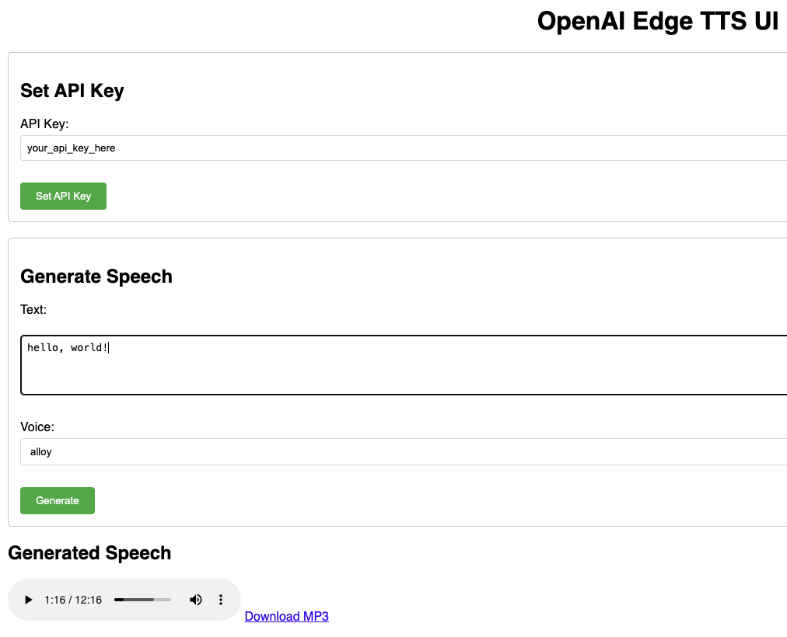

# FastAPI Web UI for OpenAI-Edge-TTS

Reference: https://github.com/travisvn/openai-edge-tts  

To run:  
```sh
uvicorn main:app --reload
```

OR  

To build and run using Docker Compose:
```sh
docker-compose up --build
```

Open the URL: http://127.0.0.1:8000/  


